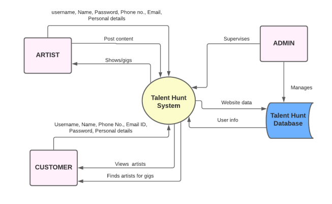

# Dextrocity
A BCA Final Year Major Project focused on UI/UX Design, Cloud Services and Database Management

# Overview
We aim to boost an artist's potential and provide a digital stage to showcase their skills. Our Talent Management project allows artists to display their works to an audience seeking to hire artists for events like music, dance, acting, public speaking, painting, etc. Customers can use this platform to choose from a wide range of artists for their events. The project aims to create an application that helps artists expand their audience and makes it easy for 
event organisers to pick the right performer. The Talent management project aims to 
manage artists' information, work and projects and provide customers with an online 
booking system. Finding the right artist for an event is now effortless through our digital 
solution. Our website helps customers and artists establish a communication channel for 
potential bookings and performances. This platform not
only simplifies the search for talented artists and helps artists find new clients and 
performance opportunities

# Features
* The Artists can publish their content for better reach and grow their audience.
* Customers can find Artists of various kinds and book them for shows.
* Customers can publish their events to get more artist entries.
* Artists can look up events and register if they are interested.
* Users can avail of offers depending on their interaction on the website.
* Customers can like artists to save them for future events.
* A premium membership will provide additional features and better visibility on the website.
* Customized email- The users can opt for email notifications if they want to be notified about some new artists or the events organized.
* Real-time chatting and interaction between artists and customers.
* Realtime User support to handle any technical or non-technical issues.
* FAQs- Frequently asked questions will be answered.
* User authentication: The website will have a secure user authentication system to ensurethat only authorized users can access the platform.
* Event management: Customers can create and manage events on the platform, whileartists can search for and apply to perform at events.
* Payment processing: The website will have a secure payment processing system to enable customers to pay for events and artists to receive payment for their performances.
* Artist profile: Artists can create a profile on the platform to showcase their work,experience, and skills.
* Search and filtering: Customers can search for and filter artists based on specific criteria,such as location, genre, and experience.
* User reviews and ratings: Customers can leave reviews and ratings for artists after events,providing valuable feedback for both artists and customers.
* Customer support: The website will have a customer support system to handle customer inquiries and resolve any issues that may arise.
* Analytics: The platform will have a dashboard to provide insights into customer and artist behavior, allowing the company to make informed decisions.

# Tools Used
* Font End: HTML, CSS, Javascript
* Back End: PHP, MySQL
* Cloud Services: AWS S3, AWS RDS, AWS EC2
* Visual Studio Code
* MySQL Workbench
* Tawk.to
* Xampp Server

# Data Flow Diagram

